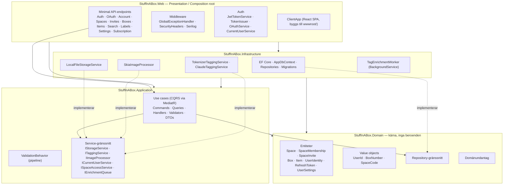
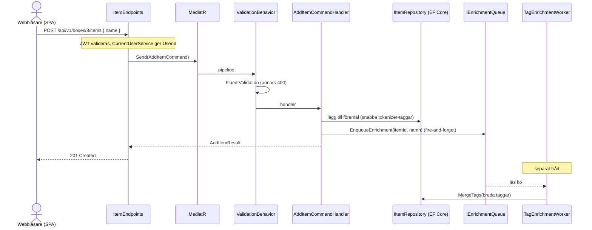
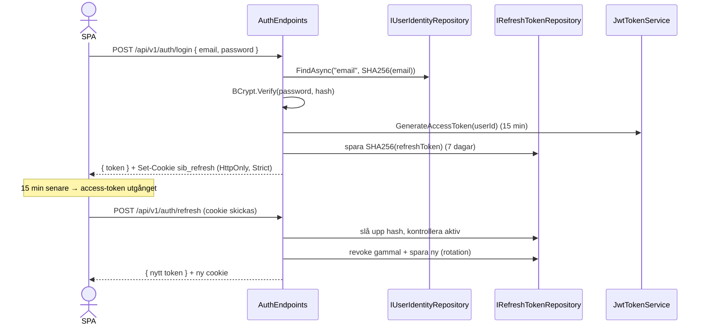
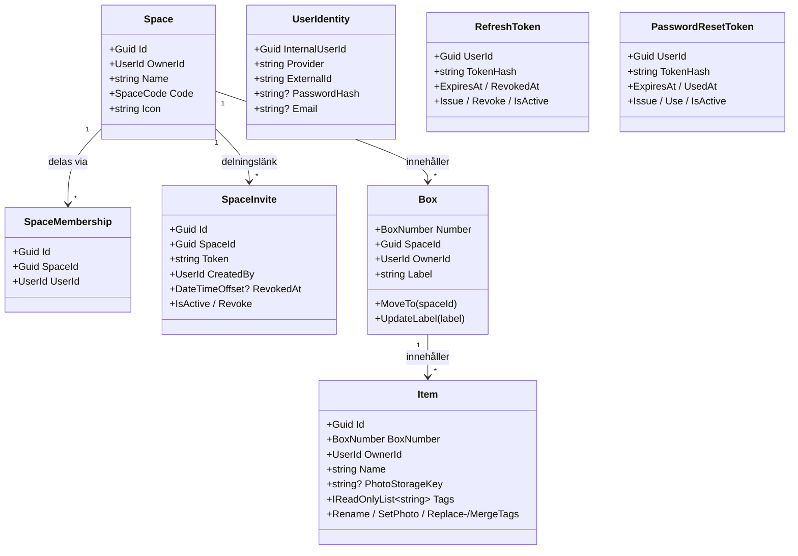
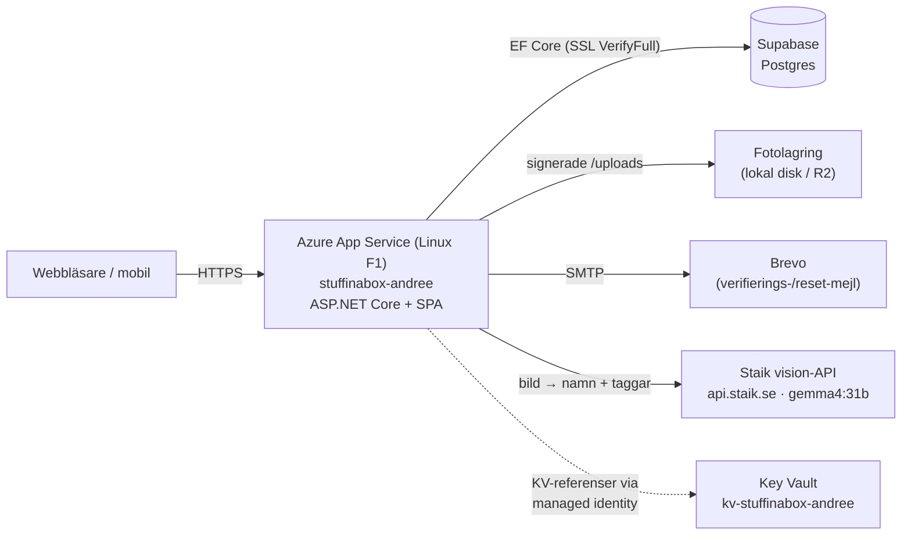
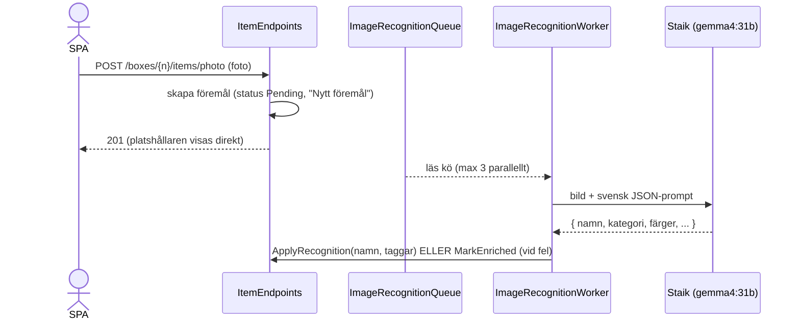
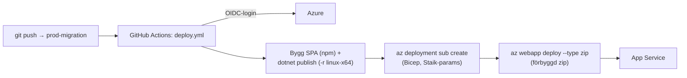
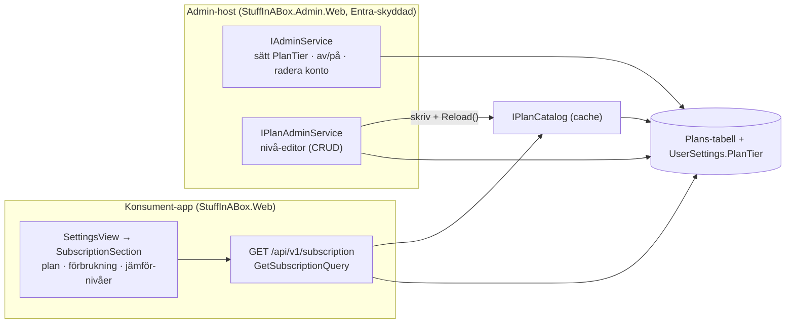

# Arkitektur — StuffInABox

Det här dokumentet beskriver nuläget: lagerindelning, beroenderegler, hur ett
request flödar genom systemet, samt auth-, taggnings- och lagringsmekanismerna.

---

## 1. Clean Architecture — lager och beroenderiktning

Beroenden pekar **alltid inåt**. Domain är kärnan och känner inte till något yttre
lager. Web är composition root och kopplar ihop allt.



**Regeln i praktiken:** ett use case (Application) anropar bara gränssnitt
(`IBoxRepository`, `IStorageService`, …). De konkreta implementationerna lever i
Infrastructure och kopplas in via dependency injection i `Program.cs` /
`Infrastructure/DependencyInjection.cs`.

---

## 2. Request-flöde (command via MediatR)

Exempel: lägg till ett föremål (`POST /api/v1/boxes/{n}/items`).



Snabba taggar (tokenisering av namnet) sätts synkront så sparet aldrig blockeras.
Bredare taggar (synonymer/kategori/material) berikas asynkront av workern.

Handlern auktoriserar först anropet via `ISpaceAccessService` (ägare-eller-medlem mot
`spaceId`) och använder den resolverade ägaren som `OwnerId` på det nya föremålet — se §4b.

Fel hanteras centralt av `GlobalExceptionHandler` som mappar undantag till HTTP-status:
`ValidationException`/`InvalidImageException` → 400, `NotFoundException` → 404,
`ForbiddenException` → 403, `UnauthorizedAccessException` → 401, övrigt → 500.

---

## 3. Autentisering

### 3a. Lösenord + refresh-token



Frontendens axios-interceptor fångar 401, anropar `/refresh` en gång och kör om
det ursprungliga anropet. Vid sidladdning återställs sessionen tyst från cookien.

**Native-klienter (mobil):** browsern håller refresh-token i HttpOnly-cookien (aldrig
i JavaScript). Native-appar utan cookie-hantering signalerar istället med headern
`X-Client: mobile` och får refresh-token **i svarsbody** att lagra säkert
(Keychain/Keystore), och förnyar via headern `X-Refresh-Token`. All trafik ligger
under det versionerade prefixet `/api/v1` (`ApiRoutes.cs`).

**Glömt lösenord:** e-postkonton lagrar adressen i klartext (`UserIdentity.Email`) för
att kunna mejla en återställningslänk. `POST /auth/forgot-password` svarar alltid `200`
(avslöjar inte om adressen finns) och skapar en `PasswordResetToken` (hash lagras, rå
token i `/#reset=<token>`-länken, engångs, 1 h). `POST /auth/reset-password` byter
lösenord och återkallar alla sessioner. E-post går via `IEmailService` — default loggar
meddelandet (`LoggingEmailService`); en riktig leverantör pluggas in bakom `Email:Provider`.

### 3b. OAuth (Google / Microsoft / Apple, Authorization Code + PKCE)

```mermaid
sequenceDiagram
    actor U as Webbläsare
    participant O as OAuthEndpoints
    participant P as Leverantör (Google/Microsoft/Apple)
    participant UR as IUserIdentityRepository

    U->>O: GET /api/v1/auth/google/start
    O->>O: skapa state + PKCE verifier/challenge
    O-->>U: 302 → leverantörens authorize-URL<br/>(scope "openid email"; cookie sib_oauth = state:verifier)
    U->>P: loggar in & godkänner
    P-->>U: 302 → /api/v1/auth/google/callback?code&state
    U->>O: callback (cookie följer med)
    O->>O: validera state, byt code+verifier mot id_token
    O->>O: läs `sub` + `email` (Google/Microsoft) ur id_token
    O->>UR: slå upp/skapa UserIdentity(provider, sub, email)
    O-->>U: 302 → /#token=JWT  (+ refresh-cookie)
```

SPA:n läser access-token ur URL-fragmentet vid laddning och rensar det ur historiken.
Apple-client-secret signeras on-the-fly med ES256 från konfigurerad .p8-nyckel.

**E-postinsamling:** Google och Microsoft begär `scope="openid email"` och
`OAuthService.ExchangeCodeForPrincipalAsync` läser `email`-claimen ur id-token, så adressen
lagras på `UserIdentity.Email` — det gör att admin kan identifiera vem ett konto tillhör.
Konton som skapades innan detta **backfillas** vid nästa inloggning (`SetEmailFromProvider`
skriver aldrig över en befintlig adress). Apple är undantaget: det lämnar bara e-post via
`response_mode=form_post` vid första samtycket, så där lagras fortsatt bara `sub` (öppen TODO).
Identiteten nycklas alltid på `(provider, sub)` — e-posten är för kontakt/administration, inte
uppslag.

**Kontosammanslagning (samma e-post = samma person).** En `UserIdentity` är *en inloggningsmetod*;
`InternalUserId` är dess primärnyckel medan `UserId` pekar ut **personen** (och är det allt innehåll,
inställningar och JWT-subjektet nycklas på). För ett olänkat konto är de lika, så person-id är alltid
den *första* identitetens `InternalUserId`. Vid OAuth-inloggning: finns redan ett **verifierat** konto
med samma e-post skapas en `CreateOAuthLinked`-identitet som **delar personens `UserId`** → båda
inloggningssätten når samma data. Bara verifierat — att länka mot ett overifierat e-poststub vore en
kapningsväg (någon förregistrerar din adress med ett eget lösenord). Av samma skäl **blockeras
e-postregistrering** (`account_exists`) om ett verifierat konto med adressen redan finns. Admin-listan
grupperar per person; av/på och radering gäller alla länkade inloggningssätt.

---

## 4. Domänmodell



`BoxNumber` är unikt **per ägare** och oföränderligt — composite-nyckel `(Number, OwnerId)`
i databasen. Att flytta en låda ändrar bara `SpaceId`. `SpaceCode` härleds från namnet
(3 versaler, svenska tecken normaliseras: å/ä→a, ö→o).

Allt innehåll (lådor, föremål) ägs av **utrymmets ägare** via `OwnerId` — även det
som en inbjuden medlem lägger till. Eftersom lådnummer är per ägare disambigueras
låd-anrop med `spaceId` så att en medlems egen låda #5 och en delad låda #5 inte
krockar (se §4b).

### 4b. Åtkomst & delning

Ett utrymme kan delas med andra användare. Auktorisering är centraliserad i
`ISpaceAccessService` (Application-lagret):

- **`RequireSpaceAsync(spaceId, ownerOnly)`** slår upp utrymmet och returnerar dess
  `OwnerId` om den inloggade är **ägare** eller (när `ownerOnly=false`) **medlem** —
  annars `ForbiddenException` → 403. Returvärdet (ägarens `UserId`) används som
  effektiv ägare i alla efterföljande repo-anrop, så en medlems operationer körs mot
  ägarens data.
- **`GetAccessibleSpacesAsync()`** = ägda utrymmen + de man gått med i (används av
  `GetSpaces`, `Search`, `Labels`).

Roller: **ägaren** kan allt (byta namn/ikon, flytta lådor, ta bort utrymmet,
skapa/återkalla delningslänk, ta bort medlemmar). **Medlemmar** kan se och redigera
lådor och föremål men inte hantera utrymmet. Hanterings-handlers använder
`ownerOnly: true`; läs/skriv av innehåll använder ägare-eller-medlem. Box-handlers
verifierar dessutom att lådan ligger i det auktoriserade utrymmet, så en medlem inte
kan nå ägarens andra, icke-delade utrymmen.

**Delningslänk:** ägaren skapar en `SpaceInvite` med en slumpad URL-säker token.
Mottagaren öppnar `/#invite=<token>`, förhandsgranskar utrymmet och accepterar —
vilket skapar en `SpaceMembership`. Länken är återkallningsbar (`RevokedAt`); befintliga
medlemmar behåller åtkomst tills de tas bort eller lämnar.

---

## 5. Tvärgående mekanismer

| Mekanism | Var | Not |
|----------|-----|-----|
| **Loggning** | `Program.cs` (Serilog) | Konsol + roterande dagsfil (`logs/stuffinabox-.log`), request-loggning. |
| **Databas-swap** | `Infrastructure/DependencyInjection.cs` | `Database:Provider`-switch; entitetskonfig undviker provider-specifika typer. |
| **Bildlagring** | `IStorageService` | Lokal disk nu; byts mot t.ex. Azure Blob utan schemaändring (nyckel, inte URL, lagras). |
| **Taggning** | `ITaggingService` | Tokenizer default; Claude API bakom `Tagging:Provider`-flagga. |
| **Bildigenkänning** | `IImageRecognitionService` | Tre providers bakom `ImageRecognition:Provider`: `none` (no-op), `ollama` (self-hostad vision-modell) och `staik` (hostad, OpenAI-kompatibel vision-API — **prod kör denna**, modell `gemma4:31b`). Den svenska prompten och den toleranta JSON→tagg-parsningen delas av providers i `VisionRecognition`; bara HTTP-transporten skiljer. Returnerar `{ namn, taggar }` (föremål, färger, material, boktitlar; flera föremål → blandad rubrik men alla som taggar). Strikta guardrails (JSON-only-prompt + normalisering); kastar aldrig (null vid fel). Körs i bakgrunden — se §7. |
| **Bakgrundsjobb** | `TagEnrichmentWorker`, `ImageRecognitionWorker` | In-process `Channel<T>` + `IHostedService`, bounded concurrency (max 3); kastar aldrig, blockerar aldrig sparet. Igenkänningsjobbet markerar alltid föremålet "berikat" (slutar snurra) även när igenkänning är av eller misslyckas. |
| **Tema** | `ClientApp` `themeStore` | Ljust/mörkt via CSS-variabler och `data-theme`, persisterat i `localStorage`. Flimmerfritt: en liten inline-init i `index.html` sätter temat före första paint, tillåten av CSP via sin SHA-256-hash (ingen `'unsafe-inline'` för skript). Ändras skriptet måste hashen i `SecurityHeadersMiddleware` räknas om. |
| **Prenumeration** | `IPlanCatalog` + `UserSettings.PlanTier` | Plan-katalog (nivåer + gränser) läses via `IPlanCatalog`; användarens nivå på `UserSettings.PlanTier`. Se §8. |
| **Health checks** | `Program.cs` + `DatabaseHealthCheck` | `/health` (liveness) och `/health/ready` (readiness, kollar DB) för orkestrering. |
| **Drift** | `Dockerfile`, `docker-compose.yml`, `.github/workflows/ci.yml` + `deploy.yml` | Multi-stage-bygge (SPA + .NET → Linux-runtime), CI som bygger och testar; CD deployar till Azure (se §7). SkiaSharp Linux-native-assets ingår så bildbehandling fungerar i container. |
| **Version** | `VersionEndpoints` + UI-footer | `GET /version` (anonym) returnerar `{ version, commit, buildTimeUtc }`. Commit bakas in vid bygge via `SourceRevisionId` (ett MSBuild-target kör `git rev-parse HEAD`). Gör att man direkt kan se exakt vilken commit som kör — fångar "stale deploy". |

---

## 6. Frontend (React SPA)

```
ClientApp/src/
├── api/        # axios-klient (JWT-interceptor, 401→refresh) + en fil per resurs (inkl. invites)
├── i18n/       # lätt egen i18n: messages (sv/en) + useT-hook + språkdetektering
├── store/      # Zustand: authStore · uiStore · settingsStore · i18nStore · lightboxStore
├── features/   # auth · home · space · box · addItem · search · labels · settings · invite
├── shared/     # AppHeader · Icon · SpaceIconPicker · ImageLightbox · useQrCode
└── App.tsx     # vy-växling (state-driven; query åsidosätter vy)
```

- **Server-state**: React Query (cache, bakgrunds-refetch, invalidering vid mutationer).
- **UI/auth/inställnings-/språk-state**: Zustand. Tema + design persisteras på kontot
  (DB) och i `localStorage`; språk i `localStorage` med webbläsardetektering (engelska
  som fallback).
- **Delning**: `space/SharePanel` (ägarens länk + medlemslista) och
  `invite/InviteAcceptSheet` (förhandsgranska + gå med). Låd-/föremåls-anrop trådar
  `spaceId` så delade utrymmen resolvar rätt ägare.
- **Routing**: tillståndsdriven (ingen URL-router); `#box=N` är en QR-deeplänk,
  `#invite=<token>` öppnar en accept-dialog, och `#token=…` tas emot från OAuth-callbacken.
- **Lägg till föremål** (`addItem/AddItemSheet`): en toggle väljer **Foto** (default —
  bulkuppladdning, varje foto blir ett föremål med platshållarnamn som bakgrunds­igen­känningen
  fyller i) eller **Manuellt** (skriv namn + valfria taggar direkt, inget foto). Båda
  använder destinationsväljaren; manuellt anropar `AddItemCommand`-endpointen direkt.

---

## 7. Drift & deployment (produktion)

Hostas på **Azure App Service (Linux, F1 Free)** i resursgruppen `rg-stuffinabox-prod`
(prenumeration "Stuff in a Box"). All infrastruktur är **Bicep** (`infra/`), deployad
subscription-scoped. Appen serverar både API:t och den byggda SPA:n (wwwroot).



**Hemligheter:** appen har en system-assigned managed identity med rollen *Key Vault
Secrets User*. App settings som behöver hemligheter är **Key Vault-referenser**
(`@Microsoft.KeyVault(...)`) som identiteten löser vid runtime — deploy/pipeline hanterar
aldrig hemlighetsvärden. Secrets i valvet: `Db-Connection`, `Jwt-Secret`,
`Email-Smtp-Password`, `OAuth-Google-ClientSecret`, `OAuth-Microsoft-ClientSecret`,
`Staik-ApiKey`, `Ollama-ApiKey`.

**Bildigenkänning i prod** går till **Staik** (`api.staik.se`), ett hostat,
OpenAI-kompatibelt vision-API. `StaikImageRecognitionService` skickar fotot som en
base64-`data:`-URI i ett `image_url`-meddelande till `POST /v1/chat/completions` och
parsar svaret med den delade `VisionRecognition`-logiken. Flödet är asynkront:



> **Fallback:** en self-hostad **Ollama** (`gemma3:12b` via Tailscale Funnel + Caddy
> token-grind) finns kvar som alternativ provider. Man flippar tillbaka genom att sätta
> `imageRecognitionProvider='ollama'` i `infra/main.bicepparam` och deploya. Den lokala
> stacken är normalt **avstängd** (inkl. autostart).

### CI/CD — GitHub Actions (OIDC)

Push till `prod-migration` kör `.github/workflows/deploy.yml`. Autentisering sker via
**GitHub OIDC** (federated credential mot en Entra-app med Contributor på prenumerationen)
— inget Azure-lösenord lagras i GitHub. Endast icke-hemlig config skickas som GitHub-vars;
appens hemligheter ligger i Key Vault.



**Fallgropar (dokumenterade):** zip-deploy måste vara en *äkta* zip med framåtsnedstreck
(`shutil.make_archive`/Python `zipfile`) — en Windows-`tar -a -c -f x.zip` blir ett
tar-arkiv och `azure/webapps-deploy@v3` matad med en mapp triggar en Oryx-build som hänger
OneDeploy på F1. En avbruten OneDeploy kan lämna ett föräldralöst Kudu-lås
(`/home/site/locks/deployment/info.lock`) → "Another deployment is in progress"; rensas via
Kudu VFS. Verifiera alltid efter deploy att `GET /version` visar rätt commit.

---

## 8. Prenumerationsnivåer (plan-katalog & entitlements)

StuffInABox har tre nivåer (**Låda / Hushåll / PRO**, interna nycklar `free`/`medium`/`large`).
Tre lager hålls isär så att en prismodell kan bytas utan att röra affärslogiken:

| Fråga | Var | Not |
|-------|-----|-----|
| *Vad en nivå innehåller* | **plan-katalog** (`IPlanCatalog`, DB-baserad) | Nivåernas gränser/flaggor. Data, redigeras i admin. |
| *Vilken nivå en användare har* | `UserSettings.PlanTier` | UserId-nyckel, ingen FK → icke-brytande. |
| *Var det kontrolleras* | command-handlers via `IEntitlementService` | `EnsureCanAdd{Space,Item,Member}` mot **ägaren**. Numeriska kvoter inkopplade (Fas 3a); AI-mån/lagring + flaggor = Fas 3b. |

**Delningsmodell (regeln som löser nivåer + delning):** **ägarens nivå styr hela utrymmet.**
Allt innehåll ägs av `Space.OwnerId`, så kvoten dras alltid från ägaren — aldrig från en
medlem. En medlem kan alltså vara på gratisnivå och ändå gå med i en betald ägares utrymme
(gästen kostar inget), medan medlems*gränsen* (inkl. ägaren: 1 / 2 / 5) styrs av ägarens nivå,
så en gratisägare inte kan dela. Nedgradering är icke-destruktiv: befintlig data/medlemmar
behålls, bara nya tillägg spärras (grandfathering).

**Plan-katalogen** (`IPlanCatalog` i `Application.Admin`, implementation `PlanCatalog` i
Infrastructure) läser nivåerna från **DB-tabellen `Plans`** med en minnescache (`Reload()` efter
admin-ändringar), och faller tillbaka på en inbyggd uppsättning (`PlanDefaults`, som även är
seed-källan) om tabellen är tom. `PlanSeeder` fyller tabellen vid uppstart (idempotent). Planerna
sorteras på `SortOrder`. Katalogen är registrerad i `AddInfrastructure` (singleton, når scoped
`AppDbContext` via en scope-factory) och **delas av både konsument-appen och admin-hosten**.



**Konsumentyta (läsvy):** `GET /api/v1/subscription` (`GetSubscriptionQuery`) returnerar
användarens nuvarande plan, förbrukning mot gränserna och hela nivålistan. Renderas som ett
block i Settings (`SubscriptionSection`): plan + pris, förbruknings­mätare för alla fyra axlarna
(utrymmen, föremål, AI-foton/mån, lagring) och jämför-nivåer-kort med "Uppgradera"-CTA.

**Adminyta (skrivvy):** den **separata admin-hosten** (`StuffInABox.Admin.Web`, Entra-OIDC,
`alla i tenanten = admin`) kan: sätta nivå (`IAdminService.SetPlanTierAsync`, validerat mot
`IPlanCatalog`), **redigera själva katalogen live** (`IPlanAdminService` → `PUT/DELETE
/api/admin/plans` + nivå-editor i konsolen), samt hantera konton. Kontohantering har **två skilda
åtgärder**: `SetDisabledAsync` (`UserIdentity.DisabledAt`) = **reversibel spärr** (login/OAuth/
refresh avvisas, data kvar), och `DeleteUserAsync` = **permanent radering** via den delade
`IAccountDeletionService` (samma kaskad som konsumentens egen GDPR-radering: utrymmen, föremål,
foton, medlemskap, tokens, settings, identitet). Admin och konsument delar Domain/Infrastructure
och samma databas men är skilda publika ytor.

**Enforcement:** `IEntitlementService` löser ägarens plan och kastar `QuotaExceededException` när
en åtgärd skulle överskrida en gräns. Inkopplat i `CreateSpace` (utrymmen), `AddItem`/
`CreateItemFromPhoto` (föremål), `AcceptInvite` (medlemmar, inkl. ägaren i taket) och foto-upload
(**lagring** — `EnsureCanStoreAsync` mot summan av `Item.PhotoSizeBytes`). `GlobalExceptionHandler`
mappar undantaget till **403 med `code: "quota_exceeded"`** + `{quota, limit, plan}`; klientens
axios-interceptor visar en global uppgradera-modal (`QuotaNoticeModal`). Kontrollerna är additiva
→ nedgradering blockerar bara nya tillägg (grandfathering). Settings-blocket visar **riktiga
mätare** för alla fyra axlarna.

**AI-kvoten (`AiPhotosPerMonth`) är tidsmässigt frikopplad** från de övriga: `HasAiCreditAsync`
*gatar* bara om igenkänning ska köas (`UserSettings.AiUsedThisMonth`, nollställs vid månadsskifte
via `AiUsageYearMonth`); krediten **dras först när en körning faktiskt gav ett resultat** —
`ImageRecognitionWorker` anropar `RecordAiRunAsync` bara då. En körning som inte ger något (AI av i
dev, tomt svar) markerar föremålet **`ItemEnrichmentStatus.Skipped`** utan att kosta kredit. Slut på
kvot vid uppladdning → föremålet skapas ändå som `Skipped`. Sådana kan köras på begäran via
**`POST /items/{id}/recognize`** (`RecognizeItemCommand`, `EnsureAiCreditAsync` → 403 vid slut kvot;
no-op om redan `Completed`) — "Kör AI"-knappen (gnistan) på kortet, som bara visas för `Skipped`.
**Kvar:** prioriterad AI-kö i workern (för betalande).

De verkliga kostnadshävstängerna som motiverar nivåerna (AI-igenkänning i två steg, worker med
3-parallell-gräns, R2-lagring, delade spaces) är beskrivna i idéskissen
`StuffInABox-subscription-tiers-idea.md` utanför repot.
