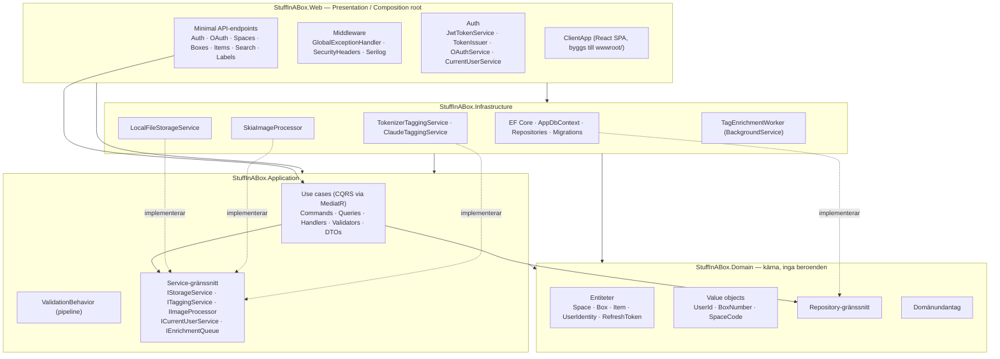
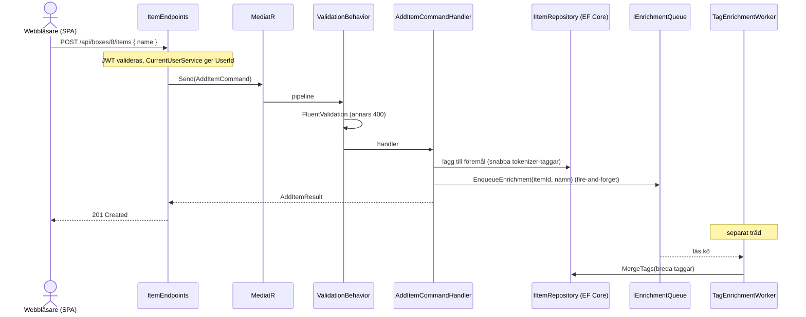
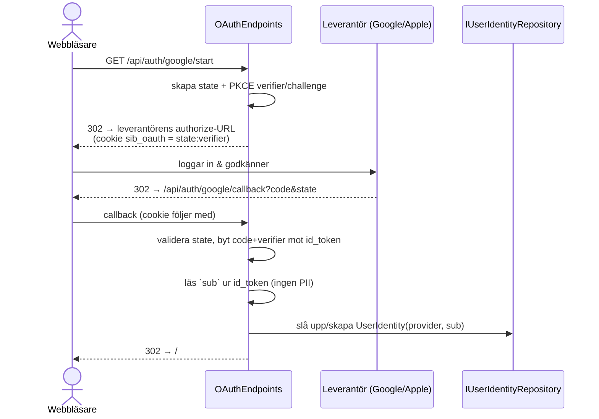
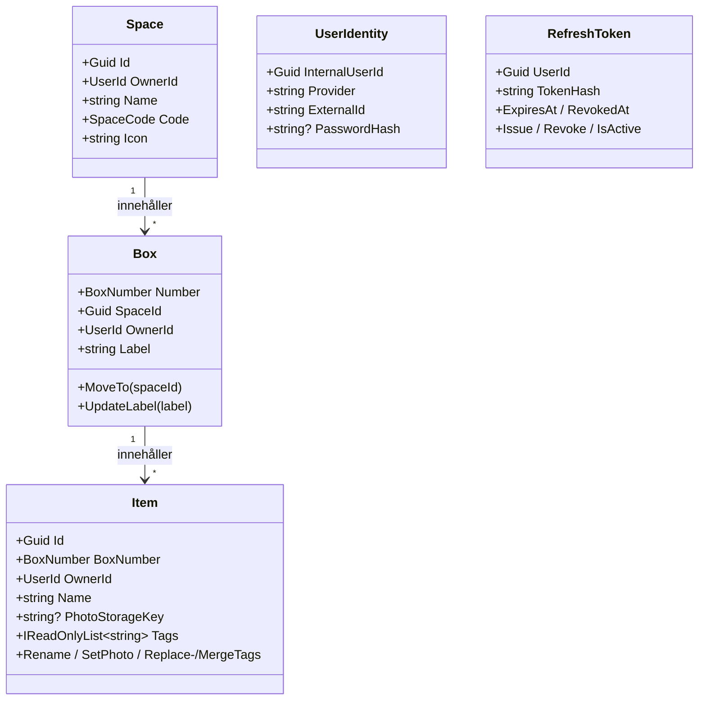

# Arkitektur — StuffInABox

Det här dokumentet beskriver nuläget: lagerindelning, beroenderegler, hur ett
request flödar genom systemet, samt auth-, taggnings- och lagringsmekanismerna.

---

## 1. Clean Architecture — lager och beroenderiktning

Beroenden pekar **alltid inåt**. Domain är kärnan och känner inte till något yttre
lager. Web är composition root och kopplar ihop allt.



**Regeln i praktiken:** ett use case (Application) anropar bara gränssnitt
(`IBoxRepository`, `IStorageService`, …). De konkreta implementationerna lever i
Infrastructure och kopplas in via dependency injection i `Program.cs` /
`Infrastructure/DependencyInjection.cs`.

---

## 2. Request-flöde (command via MediatR)

Exempel: lägg till ett föremål (`POST /api/boxes/{n}/items`).



Snabba taggar (tokenisering av namnet) sätts synkront så sparet aldrig blockeras.
Bredare taggar (synonymer/kategori/material) berikas asynkront av workern.

Fel hanteras centralt av `GlobalExceptionHandler` som mappar undantag till HTTP-status:
`ValidationException`/`InvalidImageException` → 400, `NotFoundException` → 404,
`ForbiddenException` → 403, `UnauthorizedAccessException` → 401, övrigt → 500.

---

## 3. Autentisering

### 3a. Lösenord + refresh-token


Frontendens axios-interceptor fångar 401, anropar `/refresh` en gång och kör om
det ursprungliga anropet. Vid sidladdning återställs sessionen tyst från cookien.

### 3b. OAuth (Google / Apple, Authorization Code + PKCE)



SPA:n läser access-token ur URL-fragmentet vid laddning och rensar det ur historiken.
Apple-client-secret signeras on-the-fly med ES256 från konfigurerad .p8-nyckel.

---

## 4. Domänmodell



`BoxNumber` är globalt unikt och oföränderligt — composite-nyckel `(Number, OwnerId)`
i databasen. Att flytta en låda ändrar bara `SpaceId`. `SpaceCode` härleds från namnet
(3 versaler, svenska tecken normaliseras: å/ä→a, ö→o).

---

## 5. Tvärgående mekanismer

| Mekanism | Var | Not |
|----------|-----|-----|
| **Loggning** | `Program.cs` (Serilog) | Konsol + roterande dagsfil (`logs/stuffinabox-.log`), request-loggning. |
| **Databas-swap** | `Infrastructure/DependencyInjection.cs` | `Database:Provider`-switch; entitetskonfig undviker provider-specifika typer. |
| **Bildlagring** | `IStorageService` | Lokal disk nu; byts mot t.ex. Azure Blob utan schemaändring (nyckel, inte URL, lagras). |
| **Taggning** | `ITaggingService` | Tokenizer default; Claude API bakom `Tagging:Provider`-flagga. |
| **Bakgrundsjobb** | `TagEnrichmentWorker` | In-process `Channel<T>` + `IHostedService`; kastar aldrig, blockerar aldrig sparet. |
| **Tema** | `ClientApp` `themeStore` | Ljust/mörkt via CSS-variabler och `data-theme`, persisterat i `localStorage`. Flimmerfritt: en liten inline-init i `index.html` sätter temat före första paint, tillåten av CSP via sin SHA-256-hash (ingen `'unsafe-inline'` för skript). Ändras skriptet måste hashen i `SecurityHeadersMiddleware` räknas om. |

---

## 6. Frontend (React SPA)

```
ClientApp/src/
├── api/        # axios-klient (JWT-interceptor, 401→refresh) + en fil per resurs
├── store/      # Zustand: authStore · uiStore · themeStore
├── features/   # auth · home · space · box · addItem · search · labels
├── shared/     # AppHeader · SpaceIconPicker · useQrCode
└── App.tsx     # vy-växling (state-driven; query åsidosätter vy)
```

- **Server-state**: React Query (cache, bakgrunds-refetch, invalidering vid mutationer).
- **UI/auth/tema-state**: Zustand.
- **Routing**: tillståndsdriven (ingen URL-router); `#box=N` är en QR-deeplänk och
  `#token=…` tas emot från OAuth-callbacken.
